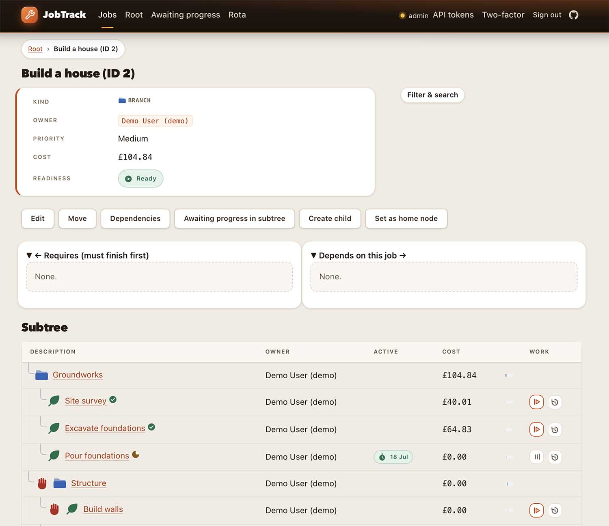

# JobTrack



A hierarchical job/work-tracking system with dynamic, historically-accurate costing.

JobTrack records hierarchical jobs, their prerequisites, actual work, achievement, employee
schedules, labour rates, and dynamically calculated costs. Jobs form a single-rooted tree of
branches and leaves; a leaf can have multiple work sessions (pause/resume without restructuring
the tree); achievement state is recursively derived from the hierarchy; and cost is calculated
dynamically from effective-dated labour rates, per-job rate overrides, and the actual time worked,
rather than stored as a static number.

[Live Google Cloud Run demo](https://jobtrack-web-716005672573.europe-west1.run.app)

That demo (SQLite backend) is deployed by [`scripts/deploy-cloudrun.sh`](scripts/deploy-cloudrun.sh),
which needs a running local Docker daemon — see
[`docs/operations/docker-image.md`](docs/operations/docker-image.md#cloud-run-smoke-test-2026-07-17).
See [ADR 0014](docs/decisions/0014-single-server-deployment.md) and
[`docs/operations/production-deployment.md`](docs/operations/production-deployment.md) for the real
deployment strategy using Postgres. The code here supports both backends.

## Architecture

JobTrack is built and layered strictly bottom-up — database contracts, then the reusable library,
then the HTTP API, then the ASP.NET Core web interface — and each layer only ever calls the one
beneath it:

1. **Database** (`database/{postgresql,sqlite}/`, `JobTrack.Database`) — versioned schema scripts
   and the invariants (constraints, triggers) that hold regardless of what calls them. Postgresql
   is the primary backend with SQLite as a full-feature fallback option.
2. **Reusable .NET library** (`JobTrack.Abstractions`/`Domain`/`Application` +
   `JobTrack.Persistence.{PostgreSql,Sqlite}`) — the cost engine, interval algebra, achievement
   rules, authorization, and audit, exposed through the single `IJobTrackClient` facade. Any .NET
   front end can consume this directly and in-process — `JobTrack.AdminCli` and the
   `samples/JobTrack.Sample.*` projects do exactly that, with no HTTP involved.
3. **External HTTP API** (`JobTrack.Web`, routes under `/api/*`) — a transport over
   `IJobTrackClient` for callers that are *not* on the same trusted host: a resource-oriented JSON
   API, authenticated by either the browser's cookie session or an opaque bearer personal access
   token (PAT), for non-browser/remote clients such as a CLI. See "External HTTP API" below.
4. **ASP.NET Core web interface** (`JobTrack.Web`, Razor Pages) — the server-rendered browser
   front end, backed by ASP.NET Core Identity for authentication. Layers 3 and 4 are both hosted by
   `JobTrack.Web`, but neither ever bypasses `IJobTrackClient` to reach the database directly.

Supporting projects, not part of that chain:

- **Dual-provider persistence** — PostgreSQL (`JobTrack.Persistence.PostgreSql`) is the primary,
  authoritative datastore for production use. SQLite (`JobTrack.Persistence.Sqlite`) is not a
  reduced-feature fallback: it is a **fully conforming**, independently supported second backend —
  every domain rule, invariant, and query behaves identically on both, asserted by a shared
  contract-test suite — intended for embedded/single-node deployments where running a separate
  PostgreSQL server isn't warranted. The two are mutually exclusive per deployment (pick one via
  `Database:Provider`), not an automatic runtime failover from one to the other.
- **`JobTrack.AdminCli`** — a narrowly scoped CLI for one-time administrator bootstrap and
  emergency password reset, consuming the library in-process (layer 2), not over HTTP.

Stack: .NET 10, C# 14, EF Core 10, Noda Time, ASP.NET Core Identity, xUnit + AwesomeAssertions.

See [`docs/jobtrack_spec_codex.md`](docs/jobtrack_spec_codex.md) (normative specification),
[`docs/jobtrack_spec_claude.md`](docs/jobtrack_spec_claude.md) (supplementary detail),
[`docs/plans/jobtrack_impl_plan.md`](docs/plans/jobtrack_impl_plan.md) (delivery plan: phase gates,
milestone sequence, review prompts), and `docs/decisions/*.md` (ADRs closing product-semantic
decisions) for the full design. [`docs/database-entities.md`](docs/database-entities.md) walks
through the core entities (the job hierarchy, work sessions, prerequisites, rates) and the costing
algorithm. [`docs/api/jobtrack-client-design.md`](docs/api/jobtrack-client-design.md) documents the
reusable library's `IJobTrackClient` facade — every command/query group, its request/result shapes,
and the design rules (immutability, strong typing, cancellation) applied throughout.
[`docs/design-language.md`](docs/design-language.md) describes the web front end's visual design
system ("Console") — its tokens, layout primitives, and accessibility constraints.
[`docs/ownership-model.md`](docs/ownership-model.md) documents node ownership, the unassigned
pickup pool, and owner-gated work-session authorization (ADR 0031/0032).
[`docs/plans/2026-07-11-client-requester-intake-plan.md`](docs/plans/2026-07-11-client-requester-intake-plan.md)
documents requester self-service intake — a low-permission `Requester` role that submits jobs into
configured holding areas and tracks their own request's status, separate from the six operational
staff roles — closed by ADR 0033/0034. `CLAUDE.md` documents this repository's house style and
development conventions in detail.

Operational, security, and traceability reference docs, each closing a specific gate item from the
delivery plan:

- [`docs/operations/production-deployment.md`](docs/operations/production-deployment.md) — hosting
  runbook for the single-server topology (ADR 0014): dedicated service account, reverse proxy, and
  Kestrel binding on both Linux (systemd + nginx) and Windows Server (IIS/ANCM), plus PostgreSQL
  provisioning, tuning, and access-control basics on each OS.
- [`docs/operations/postgresql-backup-restore.md`](docs/operations/postgresql-backup-restore.md) —
  what the automated backup/restore smoke test proves, and the manual procedure it's modelled on.
- [`docs/operations/docker-image.md`](docs/operations/docker-image.md) — the SQLite-backed container
  image for a throwaway local demo instance, pre-seeded with a `demo` administrator so it runs with
  no setup. Explicitly *not* the deployment story (ADR 0014 defers containers) and it ships a known
  credential, so it must never be network-exposed; read it before changing `Dockerfile`.
- [`docs/operations/local-live-instance.md`](docs/operations/local-live-instance.md) — running a
  single persistent local database (not a disposable `jobtrack_dev`/UAT scenario) for your own
  ongoing use, without the full production-deployment runbook. `scripts/run-web.sh` is the
  watch-and-restart launcher for it (`https (jobtrack_live)` profile; https-only, because the auth
  cookie is `Secure`-only).
- [`docs/operations/sqlite-limitations-and-configuration.md`](docs/operations/sqlite-limitations-and-configuration.md) —
  SQLite's operational envelope and required per-connection configuration (`busy_timeout`,
  `foreign_keys`, WAL mode).
- [`docs/operations/web-host-security.md`](docs/operations/web-host-security.md) — host-level
  configuration and filesystem permissions a `WebApplicationFactory` test can't exercise.
- [`docs/operations/browser-testing.md`](docs/operations/browser-testing.md) — Playwright setup and
  the real-browser end-to-end suite (see "Test" below).
- [`docs/operations/hurl-smoke-tests.md`](docs/operations/hurl-smoke-tests.md) — `tests/hurl/*.hurl`
  suites that exercise the external HTTP API and web interface over a real HTTP connection.
  `scripts/run-hurl-tests.sh` runs them in order but does **not** start the host or seed the
  database itself — start `JobTrack.Web` yourself first (see the doc for the exact commands).
- [`docs/operations/job-tree-import.md`](docs/operations/job-tree-import.md) — `JobTrack.AdminCli`'s
  `import-tree` command: the JSON file format, the already-happened-work spellings, the validation
  rules, and the worked examples in `samples/job-tree-imports/`.
- [`docs/operations/global-tools.md`](docs/operations/global-tools.md) — required .NET global CLI
  tools (mutation testing, package metadata checks) and why they're global rather than a local
  manifest.
- [`docs/operations/mutation-testing-gate.md`](docs/operations/mutation-testing-gate.md) and
  [`docs/operations/package-metadata-gate.md`](docs/operations/package-metadata-gate.md) — what each
  gate checks and how to run it.
- [`docs/threat-model/web-authentication-threat-model.md`](docs/threat-model/web-authentication-threat-model.md) —
  the web application threat model and abuse-case test plan.
- [`docs/traceability/test-catalogue.md`](docs/traceability/test-catalogue.md),
  [`docs/traceability/performance-budgets.md`](docs/traceability/performance-budgets.md), and
  [`docs/traceability/spike-report.md`](docs/traceability/spike-report.md) — test category/timeout
  budgets, performance/scale budgets, and the pre-implementation de-risking spike findings.
- [`docs/plans/README.md`](docs/plans/README.md) — index of every dated fix/remediation plan
  (`docs/plans/*.md`) and its current status, kept alongside `jobtrack_impl_plan.md` as a record of
  what each one closed.

## Who can see and change what

The short version: **anyone may look, only controllers may change** — with cost the one read that
carries its own gate.

**Reading is not ownership-gated.** Spec §7.3 gives every employee role, `Worker` included, an
unqualified "view employees and job data" baseline. Any signed-in employee can browse the whole job
tree, any node's detail, its achievement, prerequisites, readiness, and its work sessions — every
worker's, not only their own (ADR 0041). The `Requester` role is the exception: it sees only a
read-only projection of its own requests (ADR 0033).

**Writing is ownership-gated**, identically for branches and leaves (there is no branch/leaf
distinction in the rule, and ownership is inherited down the tree):

- `Administrator` and `JobManager` may manage any node — spec §7.3 gives the job manager the
  complete hierarchy.
- A `Worker` may manage only nodes they **control**: those they own directly, or that sit under an
  ancestor they own (`JobNodeAccessPolicy.CanManage`; ownership model §4, ADR 0031/0032).

Work-session recording follows node control too, not session authorship: a controlling owner may
record or correct a session for *any* worker on that node, and a Worker who controls nothing there
may record none, not even their own (`WorkSessionAccessPolicy.CanManage`). An **unassigned** node is
the exception: starting a session on one claims it for the worker the session is being recorded for,
in the same transaction, so no separate pickup step is needed (ADR 0048). Explicit `PickUpAsync`
remains the way to claim a node you are not about to start work on.

**Cost is the one gated read**, in two steps:

- `CostAccessPolicy.CanView` admits `Administrator`/`CostViewer`, **or** an owner of the node or one
  of its ancestors (ADR 0040) — so a branch you own shows its total.
- `CostAccessPolicy.CanViewNodeCost` then filters each *individual* node within it (ADR 0042): a
  branch roll-up stays visible (it is an aggregate), as does your own leaf or an unassigned one, but
  **another worker's individual leaf cost is redacted**. That figure alongside the leaf's visible
  session hours would reveal their hourly rate, which spec §7.3 reserves to the rate/cost roles.

A redacted cost simply renders blank; cost is an optional field on an otherwise browsable listing,
never a whole-request denial. See [`docs/ownership-model.md`](docs/ownership-model.md) §5.1 for the
full read/write matrix.

## Prerequisites, readiness, and completion

Prerequisites are directed edges between jobs (`RequiredJob → DependentJob`); a job is **ready**
only when every prerequisite attached to it *or to any of its ancestors* is satisfied, and a
prerequisite is satisfied only once the required job's derived achievement is `Success` (spec §6,
§5). Because a prerequisite on a branch is inherited by every descendant, it gates all work in that
subtree.

Readiness is a **hard command gate**, and it applies to exactly two operations — both rechecked
live inside their own write transaction, so a prerequisite added *after* work began is still
enforced:

- **Starting** a leaf's work session is refused while the leaf is not ready.
- **Completing** a leaf (transitioning its `LeafWork` achievement into a completed state such as
  `Success`) is refused while the leaf is not ready.

Two things are deliberately **not** gated:

- **Finishing a work session** — stopping the clock only records labour that physically happened;
  the spec keeps it ungated so a prerequisite added mid-session can't trap an active worker (and the
  recorded time stays costable regardless of later prerequisite state). Finishing a session is
  distinct from completing its `LeafWork`.
- **Branch completion** — there is no "complete this branch" command to gate, because **a branch
  carries neither a stored status nor a stored cost**. Achievement is authoritative only on leaves;
  a branch's (and the root's) achievement is derived from its descendant leaves at read time — it is
  `Success` exactly when every descendant leaf has succeeded — and never written to a column (spec
  §5.2, ADR 0035), as is the Root/Branch/Leaf label itself (from `parent_id` and child existence).
  Cost is likewise never stored anywhere in the system: every cost, leaf or branch, is computed at
  query time from the actual time worked and the effective-dated rates, a branch's being the roll-up
  sum of its descendant leaves' (`HierarchicalCostAggregator`; spec §10).

The gate is enforced in the persistence layer on both providers: `StartSessionAsync`/`StartWorkAsync`
and `SetAchievementAsync` recheck readiness *inside their own write transaction* and throw
`PrerequisiteBlockedException` if the leaf is not ready — so no request routed through
`IJobTrackClient` (library, HTTP API, or web) can bypass it. (Readiness itself is recomputed at that
moment from live achievement state, not read from a cache; the database's own prerequisite triggers
enforce the edge graph's structural invariants — acyclicity, no ancestor/descendant edge — not the
readiness gate.) See spec §6 for the normative statement.

Starting a session gates on a second, independent condition: the leaf must also be **open**. A leaf
is closed to a new active session once its achievement is terminal (`Success`, `Cancelled`,
`Unsuccessful`) or its node is archived (ADR 0044) — readiness says work *may* begin;
open/closed says the leaf hasn't already been declared finished or put away. Both conditions are
checked independently and both must hold: reopening a terminal achievement back to `Waiting` is not
enough on its own if the node is also archived, and vice versa. This is enforced the same way as the
readiness gate — inside the write transaction, backstopped by a database trigger on both providers —
so a request can't reactivate a closed leaf by any route.

## Sessions, concurrent workers, and starting for others

A leaf's recorded work is presented in the browser as **Sessions** (the noun, not a renamed type —
`WorkSession`, `LeafWork`, and the `/Jobs/Work` route are unchanged). Every leaf-listing page (Browse
rows, the Awaiting Progress dashboard, and Browse's own current-leaf toolbar) shows a Sessions link
to the leaf's complete history, and reports how many workers currently have the clock running on it.

More than one worker can be actively clocked in on the same leaf at once — this is a legitimate,
supported state, not a fixable inconsistency. The UI never picks one active worker as "the" session
to show: zero active workers shows nothing, exactly one shows a compact "Active since…" pill, and two
or more show a count (`N active`) plus a capped, stable preview of who they are — the viewer's own
session first if they have one, then every other worker in start order. The complete list is always
one click away via Sessions, regardless of how many rows are capped in a dense table view.

A user who owns a leaf (or an ancestor of it) may start a session **on behalf of another worker**
through the "Start for…" disclosure beside the ordinary one-click Start, using the same worker
picker and backdating controls everywhere else in the app. This does not change who may *view*
recorded work — session history has been visible to every employee role since ADR 0041 — only who
may create or finish a session for someone other than themselves, which remains gated by
`WorkSessionAccessPolicy.CanManage` (Administrator/JobManager unconditionally, or a Worker who
controls the leaf) and is re-checked by the command at write time regardless of what the page
rendered a moment earlier.

## The unified leaf work page

`/Jobs/Work?leafNodeId={id}` is the single interactive surface for a leaf's current status and its
Sessions (ADR 0045). It shows one obvious primary action for the current state:

- **Waiting or nothing recorded yet, no active session** — Start session (the same one-click
  `StartWorkAsync` composite described above; on an unassigned node it also claims ownership, ADR 0048).
- **In progress, no active session** — *paused*: work started and nobody is clocked on. A valid,
  ordinary state (ADR 0045 allows zero active sessions from `InProgress`) and exactly what Pause job
  produces, so it is named with a **Paused** pill wherever a leaf appears — `/Jobs/Work`, Browse's
  detail view and subtree rows, Awaiting Progress — from the single `LeafActivity.IsPaused`
  predicate. Start session resumes it; the ending decision is still offered, since completing from
  zero remaining sessions is the supported path.
- **In progress, at least one active session** — an explicit **Pause job** / **Complete job**
  decision. Pause finishes only the selected session and leaves achievement unchanged; Complete job
  atomically finishes the exact confirmed active-session set (one worker or several, all at the same
  instant) and records whichever terminal achievement its "Completion options" dropdown selects —
  `Success`, `Cancelled`, or `Unsuccessful` — in one commit (`CompleteLeafAsync`, ADR 0047, which
  supersedes ADR 0045's Success-only framing). Neither is ever implicit —
  finishing a session never silently means "done." Both share one form with the leaf's write-up and
  its own **Save write-up** button, so whichever button is pressed persists the text typed beside it.
- **A terminal leaf** (`Success`/`Cancelled`/`Unsuccessful`) — **Reopen and start session**, when the
  actor qualifies: a controlling owner, Job Manager, or Administrator may reopen and start for any
  eligible worker; a worker who recorded any previous session on that leaf may reopen and start for
  themselves only. This is `ReopenAndStartWorkAsync`, one atomic commit of the audited
  `terminal -> Waiting` transition, ADR 0038's existing `Waiting -> InProgress` auto-advance, and the
  new session — amending ADR 0001's original Administrator/JobManager-only reopen rule for this
  composite path specifically (an isolated reopen with no session following it stays
  Administrator/JobManager-only, in "Change outcome" below).
- **Archived** — no active-session action at all; the page names the restore requirement instead of
  silently reactivating a closed node.

A single "Change outcome" dropdown covers every remaining transition — each one
`AchievementTransitions.IsPermitted` allows from the current state, filtered to what the actor is
authorized for, including reopening without starting a session — through the original
`SetAchievementAsync` primitive, unchanged.

`/Jobs/Achievement`, the page's now-retired predecessor, is a compatibility redirect to
`/Jobs/Work#status`; nothing links to it directly any more.

## External HTTP API

Beyond the server-rendered Razor Pages, `JobTrack.Web` exposes a resource-oriented JSON API under
`/api/*` for clients that aren't on the same trusted host.
[`docs/api/external-http-api-reference.md`](docs/api/external-http-api-reference.md) is the full
route table, auth model, and request/response examples; `docs/plans/2026-07-09-external-http-api-plan.md`
and ADRs 0024, 0029, 0030 record the design decisions and rationale behind it. In brief:

- **Authentication** — either the browser's cookie session, or an opaque bearer personal access
  token (PAT) for non-browser clients. A PAT authenticates strictly as its issuing user and is
  revoked automatically on disablement, role changes, and password reset/change, alongside that
  user's web sessions.
- **Surface** — read-only job-tree browsing and search, work sessions (start/finish/correct/list —
  a UI "resume"/"pause"/"stop" is the same start/finish command, not a separate endpoint),
  prerequisites and achievement, and cost reports. Structural job commands, audit browsing, and
  account administration remain Razor-Pages-only for now (ADR 0030) — this is a deliberately scoped
  surface, not a mechanical mirror of every browser workflow.
- **Operational qualities** — per-user rate limiting distinct from browser login throttling, and
  bounded per-request telemetry (operation, correlation id, status, duration, stable failure
  category) that never carries a rate/cost value or a token.
- **Client proof** — `samples/JobTrack.ExternalApiClient` is a small first-party CLI client with
  **no project reference to any `JobTrack.*` library assembly**: it talks only to the published
  HTTP contract, proving the API is genuinely usable from outside the reusable .NET library.
  `tests/JobTrack.Web.EndToEndTests/ExternalApiClientProofTests.cs` drives it against both
  providers, exercising authentication, a read workflow, a mutation workflow, conflict handling,
  and revocation handling.

## Project layout

See [`docs/architecture-overview.md`](docs/architecture-overview.md) for a file-by-file table of
each layer (database, reusable library, HTTP API, web site) plus `spikes/` and `samples/`.

```
src/
  JobTrack.Abstractions            identifiers, value types, exception hierarchy — no deps
  JobTrack.Domain                  pure cost engine, interval algebra, achievement, rates
  JobTrack.Application             IJobTrackClient facade, commands/queries, auth, audit
  JobTrack.Persistence.PostgreSql  EF Core + Npgsql implementation
  JobTrack.Persistence.Shared      internal EF model config shared by both providers
  JobTrack.Persistence.Sqlite      EF Core + Sqlite implementation
  JobTrack.Identity                ASP.NET Core Identity adapter
  JobTrack.Database                schema deployment tool (no EF/domain dependency)
  JobTrack.AdminCli                bootstrap/reset CLI
  JobTrack.Web                     Razor Pages host + external HTTP API (/api/*)
samples/
  JobTrack.Sample.PostgreSql       minimal in-process IJobTrackClient consumer (PostgreSQL)
  JobTrack.Sample.Sqlite           minimal in-process IJobTrackClient consumer (SQLite)
  JobTrack.ExternalApiClient       first-party HTTP client proof — no JobTrack.* library reference
  JobTrack.UatSeed                 synthetic end-user-testing scenario seeder
  job-tree-imports/                worked JSON examples for AdminCli `import-tree`
tests/                             one test project per src project, plus
                                    JobTrack.ArchitectureTests, JobTrack.Database.ContractTests,
                                    JobTrack.PublicApi.Tests, JobTrack.Web.{IntegrationTests,EndToEndTests}
database/{postgresql,sqlite,scenarios}/   schema-versions, reference data, verification per provider
docs/{decisions,operations,plans,traceability}/
```

## Codebase size

The line count is dominated by the test suite, not the application. At the time of writing the
`src/` tree (the whole app — dual-provider persistence, costing domain, ASP.NET Identity, the
external HTTP API, and the admin CLI) is ~24.8k lines of C# plus ~3.1k of Razor, against ~52.2k
lines under `tests/` — roughly a 2:1 test-to-source ratio. That ratio is a property of the mandatory
TDD discipline (see `CLAUDE.md`), not accumulated fat: the tests are a deliverable, so a large
`tests/` total is a sign of coverage, not bloat. Recalculate the split with
[`tokei`](https://github.com/XAMPPRocky/tokei):

```bash
tokei src      # application/library code
tokei tests    # test suite
tokei          # whole repo, all languages
```

## Requirements

- .NET SDK `10.0.301` or later within the same feature band (pinned in `global.json`).
- PostgreSQL, for the primary provider and its test suites — this project expects a local instance
  reachable at the Unix socket `/tmp:5432` (no Docker setup is provided). On macOS via Homebrew:

  ```bash
  brew install postgresql@18
  brew services start postgresql@18   # starts now and re-registers it to start at login
  pg_isready -h /tmp -p 5432          # confirm the server is accepting connections
  ```

  `brew services start` (rather than `pg_ctl`/`postgres` run directly) is what keeps the server
  running across reboots without a manual step every session. Stop it with
  `brew services stop postgresql@18`; see `brew services list` for current status.
- SQLite needs no separate service — it's a local file. It's the same fully supported provider
  described above, not a lesser one used just for dev; it's used for `JobTrack.Web`'s
  *local development* `appsettings.Development.json` override purely for convenience, since it
  needs no separate service to stand up. The application's own default (`appsettings.json`,
  i.e. what a real deployment gets absent that development override) is PostgreSQL.
- [Playwright](https://playwright.dev/) browser binaries, only if you intend to run the real-browser
  end-to-end tests (not needed to build, unit-test, or run the app) — see
  `docs/operations/browser-testing.md`.

## Build

```bash
dotnet build JobTrack.slnx
```

If a build fails with a flood of unrelated-looking errors — e.g. Razor `.cshtml` markup tags
(`input`, `label`, `form`) reported as missing C# types, or `<invalid-global-code>` — the cause is
usually a wedged MSBuild/Roslyn compiler-server process from a previous run, not a real code
problem. Shut it down and rebuild:

```bash
dotnet build-server shutdown
dotnet build JobTrack.slnx
```

## Test

The per-commit gate (see `CLAUDE.md`): build, format, the fast core suite, plus a targeted
`--filter` run covering whatever the commit touches.

```bash
dotnet build JobTrack.slnx -warnaserror   # warnings are errors; analyzers + architecture tests enforced
dotnet format JobTrack.slnx
dotnet format JobTrack.slnx --verify-no-changes
./scripts/fast-test.sh --build
dotnet test tests/JobTrack.Persistence.PostgreSql.Tests --filter "FullyQualifiedName~TheClassYouChanged"
```

The full solution suite is for occasional use — once at the end of a multi-stage plan, or before
a commit that closes out a substantial piece of work — not for every commit, since it takes
several minutes:

```bash
dotnet test JobTrack.slnx
```

It runs every provider-conformance, domain, application, identity, architecture, and web test
project, against real (disposable, per-test-class) PostgreSQL and SQLite databases — a local
PostgreSQL instance must be reachable for the PostgreSQL-backed suites to pass. To run a single
project instead of the whole solution:

```bash
dotnet test tests/JobTrack.Domain.Tests/JobTrack.Domain.Tests.csproj
```

### Fast core suite

`dotnet test JobTrack.slnx` takes several minutes, most of it in the PostgreSQL/SQLite
contract, performance, and browser suites. For a rapid pre-commit sanity check (under 20
seconds), run only the projects with no external database or browser dependency:

```bash
./scripts/fast-test.sh
```

This runs `JobTrack.Domain.Tests`, `JobTrack.Application.Tests`, `JobTrack.ArchitectureTests`,
`JobTrack.Identity.Tests`, `JobTrack.Persistence.Shared.Tests`, `JobTrack.Persistence.Sqlite.Tests`,
and `JobTrack.PublicApi.Tests` with `--no-build` (pass `--build` to build first, e.g. on a clean
checkout). It covers domain/application logic, architecture-fitness rules, public API surface, and
SQLite (file-based, no server needed), and skips PostgreSQL-backed, web-integration, and browser
end-to-end coverage entirely — which is why the commit gate pairs it with a targeted `--filter` run
against whichever of those projects the commit actually touches.

For a broader check before a commit (under 80 seconds), add `--longer` (or `-l`):

```bash
./scripts/fast-test.sh --longer
```

This runs the fast core suite above plus `JobTrack.Database.ContractTests`,
`JobTrack.Persistence.PostgreSql.Tests`, and `JobTrack.Web.IntegrationTests` — the highest-value
PostgreSQL-backed, provider-specific concurrency, and web-host integration coverage — while still
skipping `JobTrack.Database.PerformanceTests`, `JobTrack.AdminCli.Tests`, and the real-browser
`JobTrack.Web.EndToEndTests` suite. `--longer` combines with `--build` (e.g. `--longer --build`).

### Cleaning up orphaned test databases

Each database-contract test class creates a disposable, uniquely named PostgreSQL database and
SQLite file and drops/deletes it on teardown — but a killed or interrupted `dotnet test` run
(timeout, Ctrl-C, crashed sandboxed process) skips that teardown and leaves orphans behind. Run
this periodically, or whenever `dotnet test` was interrupted:

```bash
./scripts/clean-test-databases.sh
```

It drops any `jobtrack_test_*` PostgreSQL database on the local instance and deletes any
`jobtrack_test_*.db`/`.db-shm`/`.db-wal`/`.db-journal` file left in `$TMPDIR`.

The real-browser end-to-end suite (`tests/JobTrack.Web.EndToEndTests`) additionally requires the
Playwright browser binaries installed once per machine:

```bash
dotnet build tests/JobTrack.Web.EndToEndTests/JobTrack.Web.EndToEndTests.csproj
pwsh tests/JobTrack.Web.EndToEndTests/bin/Debug/net10.0/playwright.ps1 install chromium firefox webkit
```

## Running on a development server

The application's own default is PostgreSQL (`appsettings.json`); the steps below apply to either
provider, run from the repository root (`dotnet run --project` does not change the process's
working directory, so a relative SQLite path resolves from wherever you invoke it — keep the
`--connection-string` consistent across all three steps so they operate on the same database).

### PostgreSQL

1. **Confirm the server is up**, then create a database for JobTrack (any name; this uses the
   default one from your Homebrew/OS user — adjust the connection string in later steps if you use
   a different role or database name):

   ```bash
   pg_isready -h /tmp -p 5432
   psql -h /tmp -p 5432 -d postgres -c "CREATE DATABASE jobtrack_dev LOCALE_PROVIDER icu ICU_LOCALE 'en-GB' TEMPLATE template0"
   ```

2. **Deploy the schema** (`--scripts-root` is required — nothing copies `database/` next to the
   built binary). `JobTrack.Database deploy` automatically applies
   `database/postgresql/roles/jobtrack-roles-and-grants.sql` afterwards — no separate
   role-provisioning step is needed against a fresh cluster:

   ```bash
   dotnet run --project src/JobTrack.Database -- deploy --provider postgresql --connection-string "Host=/tmp;Port=5432;Database=jobtrack_dev" --scripts-root database/postgresql/schema-versions
   ```

3. **Bootstrap the first administrator** (interactive — prompts for display name, IANA time zone,
   username, and password, then invokes the library's one-time atomic bootstrap command):

   ```bash
   dotnet run --project src/JobTrack.AdminCli -- bootstrap --provider postgresql --connection-string "Host=/tmp;Port=5432;Database=jobtrack_dev"
   ```

4. **Point the web app at that database and run it.** Either edit
   `src/JobTrack.Web/appsettings.Development.json` (`Database:Provider` → `PostgreSql`,
   `ConnectionStrings:JobTrackIdentity` → the connection string above) or set the equivalent
   environment variables, then:

   ```bash
   dotnet run --project src/JobTrack.Web
   ```

   This uses the `http` launch profile by default, listening on `http://localhost:5034`, and
   launches a browser automatically. Add `--launch-profile https` for
   `https://localhost:7174` (plus `http://localhost:5034`) instead — see
   `src/JobTrack.Web/Properties/launchSettings.json`. Sign in with the administrator credentials
   from step 3 — first sign-in forces an immediate password change.

   To start over, `dropdb -h /tmp -p 5432 jobtrack_dev` and repeat from step 1 — schema deployment
   is not idempotent against a database that already has JobTrack's tables.

### SQLite

`src/JobTrack.Web/appsettings.Development.json` ships pointed at a local SQLite file
(`jobtrack-web-dev.db`) by default, purely so a first local run needs no PostgreSQL setup or
connection-string editing:

1. **Deploy the schema** to a fresh SQLite file:

   ```bash
   dotnet run --project src/JobTrack.Database -- deploy --provider sqlite --connection-string "Data Source=jobtrack-web-dev.db" --scripts-root database/sqlite/schema-versions
   ```

2. **Bootstrap the first administrator**:

   ```bash
   dotnet run --project src/JobTrack.AdminCli -- bootstrap --provider sqlite --connection-string "Data Source=jobtrack-web-dev.db"
   ```

3. **Run the web app**:

   ```bash
   dotnet run --project src/JobTrack.Web
   ```

   Same launch profiles and first-sign-in behaviour as above.

`jobtrack-web-dev.db` (+ its `-shm`/`-wal` sidecar files) is gitignored and disposable — delete it
between unrelated manual runs so stale bootstrap/account state doesn't leak into the next one, then
repeat steps 1-2 before running again.

### Resetting a password

The normal way to reset an employee's password is the Administrator-only page in the web
interface. When that isn't usable — the administrator account itself is locked out, or the web
app isn't reachable — `JobTrack.AdminCli`'s `reset-password` command is the emergency fallback: it
talks to the database directly (layer 2, in-process), not over HTTP, and works against either
provider the same way `bootstrap` does:

```bash
# PostgreSQL
dotnet run --project src/JobTrack.AdminCli -- reset-password --provider postgresql --connection-string "Host=/tmp;Port=5432;Database=jobtrack_dev" --username <username>

# SQLite
dotnet run --project src/JobTrack.AdminCli -- reset-password --provider sqlite --connection-string "Data Source=jobtrack-web-dev.db" --username <username>
```

It prints a one-time temporary password to relay to the employee out-of-band, forces a password
change at their next sign-in, and revokes every personal access token and session tied to that
account. See `src/JobTrack.AdminCli/EmergencyPasswordReset.cs` for exactly what it does and why.

### Resetting two-factor authentication

Two-factor authentication (TOTP, ADR 0037) is optional and self-service: an employee enrols and
disables it themselves from the web interface. If they lose their authenticator device, an
administrator can clear it for them from the Administrator-only account page, or — same fallback
as a password reset — `JobTrack.AdminCli`'s `reset-2fa` command works when the web app isn't
reachable, including for the administrator account itself:

```bash
# PostgreSQL
dotnet run --project src/JobTrack.AdminCli -- reset-2fa --provider postgresql --connection-string "Host=/tmp;Port=5432;Database=jobtrack_dev" --username <username>

# SQLite
dotnet run --project src/JobTrack.AdminCli -- reset-2fa --provider sqlite --connection-string "Data Source=jobtrack-web-dev.db" --username <username>
```

It clears the account's two-factor enrolment (the employee can then sign in with their password
alone and re-enrol if they choose), revokes every personal access token and session tied to that
account, and audits the operation. See `src/JobTrack.AdminCli/EmergencyTwoFactorReset.cs`.

### Bulk-generating a tree of job nodes from JSON

`JobTrack.AdminCli`'s `import-tree` command atomically creates a whole job-node subtree from a flat
JSON array — optionally including work already done against each leaf — in one database transaction.
`samples/job-tree-imports/` has seven worked examples, from 5 to 30 nodes.
[`docs/operations/job-tree-import.md`](docs/operations/job-tree-import.md) is the command and
file-format reference.

```bash
dotnet run --project src/JobTrack.AdminCli -- import-tree --provider sqlite --connection-string "Data Source=jobtrack-web-dev.db" --username <username> --file samples/job-tree-imports/building-a-house.json
```

### Creating employees and issuing API tokens from the CLI

Two further commands exist for scripted setup, where the web interface is the normal route:

- `create-employee` provisions a non-administrator employee under an existing administrator
  (`--actor`), granting `--roles` (first entry as the initial role, the rest assigned after).
  `--no-force-password-change` clears the ADR 0023 forced-change flag, for a deliberately shared
  credential such as the container demo's `demo` account.
- `issue-token` mints a bearer personal access token for an existing account without a browser
  session — for scripting and tooling, such as the hurl smoke tests of the external HTTP API. The
  only other issuance path is the self-service API-tokens page (ADR 0029).

```bash
dotnet run --project src/JobTrack.AdminCli -- create-employee --provider sqlite --connection-string "Data Source=jobtrack-web-dev.db" --actor <admin-username> --username <username> --password <password> --display-name <name> --roles Worker
dotnet run --project src/JobTrack.AdminCli -- issue-token --provider sqlite --connection-string "Data Source=jobtrack-web-dev.db" --username <username> --label <label> [--lifetime-days <days>]
```

Run `JobTrack.AdminCli` with no arguments for the full option list of every command.

## Seeding a synthetic end-user testing (UAT) scenario

`samples/JobTrack.UatSeed` seeds a canonical, non-PII scenario on top of an already-deployed,
already-bootstrapped database (steps 1-3 above) — a requester, the six operational roles, a
holding area, an unassigned request, acknowledged/assigned work, a prerequisite blocker, an active
work session, and finished cost-reportable work with a rate applied, so a human tester (staff or
requester) has real state to explore immediately rather than an empty bootstrap admin account. It
runs through `IJobTrackClient` throughout, the same public surface a real client uses — the
department and holding-area rows are the only direct SQL, because no library command exists yet to
configure them (see `docs/plans/2026-07-11-client-requester-intake-plan.md`'s deferred
"holding-area admin UI" follow-up). Every seeded employee's password is `Uat-Seed-Battery-42!` and
forces a change at first sign-in; run it against SQLite/PostgreSQL exactly as in "Running on a
development server" above:

```bash
# SQLite, after deploy + bootstrap against jobtrack-web-dev.db:
dotnet run --project samples/JobTrack.UatSeed -- --provider sqlite --connection-string "Data Source=jobtrack-web-dev.db"

# PostgreSQL, after deploy + bootstrap against jobtrack_dev:
dotnet run --project samples/JobTrack.UatSeed -- --provider postgresql --connection-string "Host=/tmp;Port=5432;Database=jobtrack_dev"
```

The command prints every seeded user's id/username and the seeded job node ids so a tester can jump
straight to interesting state (an unassigned request to triage, a blocked leaf, an open session).

**Resetting between UAT rounds** — the seed is not idempotent (re-running it against the same
database adds a second copy of everything), so start from a fresh database each round:

- **SQLite:** delete `jobtrack-web-dev.db` (+ `-shm`/`-wal`) and repeat deploy → bootstrap → seed.
- **PostgreSQL:** `dropdb -h /tmp -p 5432 jobtrack_dev` (or `DROP DATABASE "jobtrack_dev" WITH (FORCE);`
  via `psql`), then `CREATE DATABASE` and repeat deploy → bootstrap → seed exactly as in "Running on
  a development server" above.

## License

MIT. See [LICENSE](LICENSE).
