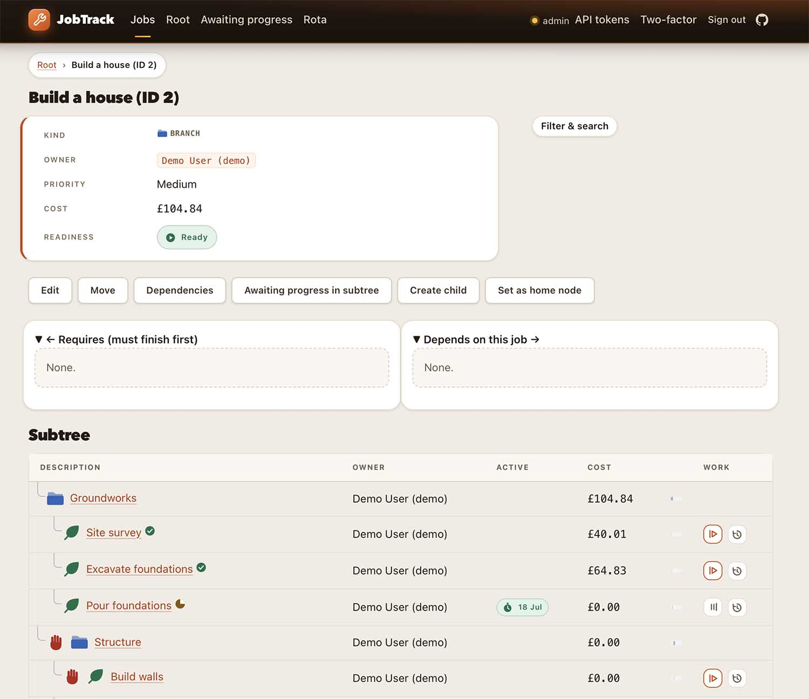

# JobTrack

A hierarchical job/work-tracking system with dynamic, historically-accurate costing.

Jobs form a single-rooted tree of branches and leaves. A leaf holds real work sessions
(pause/resume without restructuring the tree), achievement rolls up recursively, and cost is never
a stored number: it is computed on demand from effective-dated labour rates, per-job rate
overrides, employee schedules, and the exact time worked — including splitting an employee's time
fairly across concurrent sessions.

## Status

**Release-ready (1.0).** All four delivery gates — database, reusable library, web application, and
release — have formal, source-controlled acceptance records
([ADR 0025](docs/decisions/0025-m3-database-gate-acceptance.md),
[0026](docs/decisions/0026-m6-library-gate-acceptance.md),
[0027](docs/decisions/0027-m8-web-gate-acceptance.md),
[0063](docs/decisions/0063-release-gate-acceptance-and-risk-acceptance.md)). The codebase was built
test-first throughout (roughly two lines of test for every line of product code), passes its full
solution and performance suites, and has been through three internal security audits, each fully
remediated. Performance is enforced, not hoped for: measured budgets on a 200,000-node
production-shape database run as regression ceilings on every performance-suite run.

The production deployment is PostgreSQL on Google Cloud (Cloud Run + Cloud SQL, with automated
backups and point-in-time recovery), fixed by
[ADR 0062](docs/decisions/0062-cloud-run-cloud-sql-production-topology.md). Items consciously
deferred past 1.0 — observability tooling, an external penetration test, and a handful of
documented low-risk residuals — are each recorded with their rationale and revisit trigger in
[ADR 0063](docs/decisions/0063-release-gate-acceptance-and-risk-acceptance.md), so nothing deferred
is undocumented.

[Live Google Cloud Run demo](https://jobtrack-web-zeb6shxnca-ew.a.run.app) (SQLite backend — a
demonstration configuration, not the production one).

## Start here

| If you want to… | Read |
| --- | --- |
| Build, test, run, or administer it locally | [`docs/developer-guide.md`](docs/developer-guide.md) |
| Understand how it behaves for its users | [`docs/behaviour-overview.md`](docs/behaviour-overview.md) |
| See the architecture and layers file by file | [`docs/architecture-overview.md`](docs/architecture-overview.md) |
| Deploy or operate it | [`docs/operations/postgresql-cloud-run-deployment.md`](docs/operations/postgresql-cloud-run-deployment.md) |
| Contribute code | [`CLAUDE.md`](CLAUDE.md) — house style, TDD discipline, commit gate |

## In brief

- **Stack:** .NET 10, C# 14, EF Core 10, Noda Time, ASP.NET Core Identity.
- **Shape:** a strictly layered system — versioned database schema, a reusable .NET library behind
  a single client facade, an external HTTP API, and a server-rendered web interface. Each layer
  consumes only the one beneath it, and the boundaries are enforced by automated architecture
  tests, not convention. Details: [`docs/architecture-overview.md`](docs/architecture-overview.md).
- **Two databases, one behaviour:** PostgreSQL is the production backend; SQLite is a fully
  conforming second provider for embedded and demo use, held equivalent by a shared contract-test
  suite.
- **Performance:** read latency tracks the size of the question, not the size of the installation;
  hundreds of thousands of jobs and years of history sit comfortably inside the tested envelope.
  Budgets and evidence: [`docs/traceability/performance-budgets.md`](docs/traceability/performance-budgets.md).
- **Security:** defence-in-depth web hardening, split least-privilege database credentials, audited
  administrative actions, optional two-factor authentication, and a maintained threat model with
  every mitigation tied to a named test:
  [`docs/threat-model/web-authentication-threat-model.md`](docs/threat-model/web-authentication-threat-model.md).

## Documentation map

**Design and specification**

- [`docs/jobtrack_spec_codex.md`](docs/jobtrack_spec_codex.md) — normative specification
  ([`docs/jobtrack_spec_claude.md`](docs/jobtrack_spec_claude.md) supplements it).
- [`docs/plans/jobtrack_impl_plan.md`](docs/plans/jobtrack_impl_plan.md) — delivery plan and phase
  gates; [`docs/plans/README.md`](docs/plans/README.md) indexes every dated plan;
  `docs/decisions/*.md` are the ADRs.
- [`docs/database-entities.md`](docs/database-entities.md) — core entities and the costing
  algorithm.
- [`docs/api/jobtrack-client-design.md`](docs/api/jobtrack-client-design.md) — the `IJobTrackClient`
  facade; [`docs/api/external-http-api-reference.md`](docs/api/external-http-api-reference.md) —
  HTTP routes and auth model.
- [`docs/design-language.md`](docs/design-language.md) — the "Console" visual design system.
- [`docs/ownership-model.md`](docs/ownership-model.md) — node ownership, the unassigned pickup
  pool, and work authorization.
- [`docs/requester-user-guide.md`](docs/requester-user-guide.md) — submitting and tracking work as
  a `Requester`.

**Operations, security, and traceability**

- [`docs/operations/postgresql-cloud-run-deployment.md`](docs/operations/postgresql-cloud-run-deployment.md) —
  the production deployment (ADR 0062): provisioning, schema upgrades, rotation, emergency reset.
- [`docs/operations/production-deployment.md`](docs/operations/production-deployment.md) — the
  alternative self-hosted single-server runbook (ADR 0014).
- [`docs/operations/postgresql-backup-restore.md`](docs/operations/postgresql-backup-restore.md) —
  backup/restore procedure and the smoke test that proves it.
- [`docs/operations/docker-image.md`](docs/operations/docker-image.md) — the throwaway SQLite demo
  container.
- [`docs/operations/local-live-instance.md`](docs/operations/local-live-instance.md) — a single
  persistent local database for your own use.
- [`docs/operations/sqlite-limitations-and-configuration.md`](docs/operations/sqlite-limitations-and-configuration.md) —
  SQLite's operational envelope and required per-connection configuration.
- [`docs/operations/web-host-security.md`](docs/operations/web-host-security.md),
  [`docs/threat-model/web-authentication-threat-model.md`](docs/threat-model/web-authentication-threat-model.md) —
  host hardening and the authentication threat model.
- [`docs/operations/browser-testing.md`](docs/operations/browser-testing.md),
  [`docs/operations/hurl-smoke-tests.md`](docs/operations/hurl-smoke-tests.md) — the Playwright
  end-to-end suite and the `tests/hurl/` HTTP smoke suites.
- [`docs/operations/job-tree-import.md`](docs/operations/job-tree-import.md) — `AdminCli`
  `import-tree`: JSON format, validation, examples.
- [`docs/operations/global-tools.md`](docs/operations/global-tools.md),
  [`docs/operations/mutation-testing-gate.md`](docs/operations/mutation-testing-gate.md),
  [`docs/operations/package-metadata-gate.md`](docs/operations/package-metadata-gate.md) — required
  tooling and quality gates.
- [`docs/traceability/`](docs/traceability/) — test budgets, performance/scale budgets, and spike
  findings.

## License

MIT. See [LICENSE](LICENSE).
